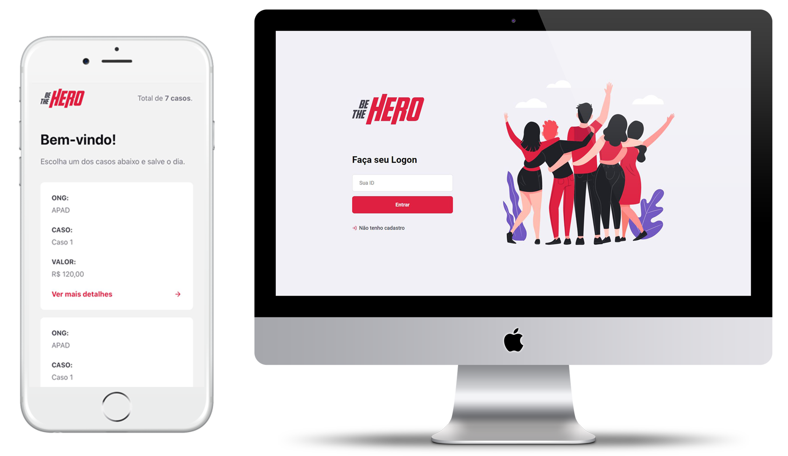

<h1 align="center">
    
</h1>

<h4 align="center">
  Be The Hero 🦸
</h4>

 

  

## :rocket: Tecnologias

Esse projeto foi desenvolvido com as seguintes tecnologias:

- [Node.js](https://nodejs.org/en/)
- [React](https://reactjs.org)
- [React Native](https://facebook.github.io/react-native/)
- [Expo](https://expo.io/)

## 💻 Projeto

O Be The Hero é um projeto desenvolvido na Semana Omnistack 11.0 pela [Rocketseat](https://rocketseat.com.br/) que visa a divulgação de casos por ONGs e qualquer pessoa pode se tornar um Herói ajudando este caso!